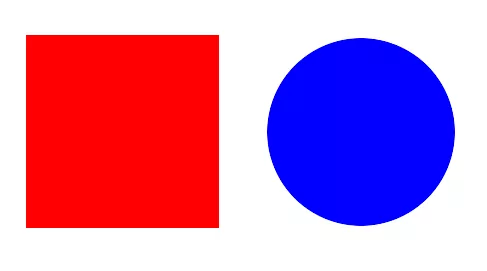

## Test

   
  <map name="shapesmap">
    <area shape="rect" coords="29,32,230,215" href="square.html" alt="Square">
    <area shape="circle" coords="360,130,100" href="circle.html" alt="Circle">
  </map>

# Include



# Collection access


  <h2>Person</h2>
  <h2>{{ person.name }} - {{ person.position }}</h2>
  
{{ person.content | markdownify }}

